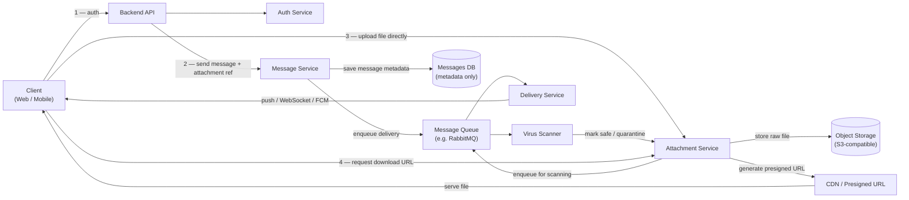
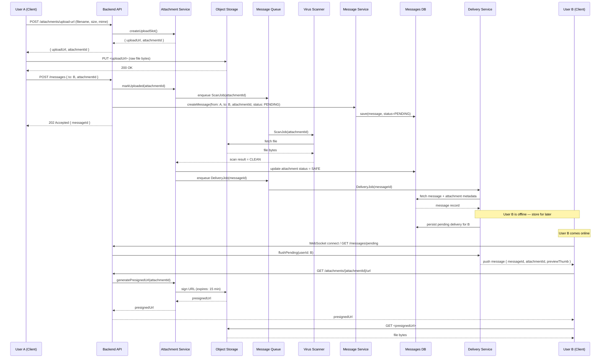
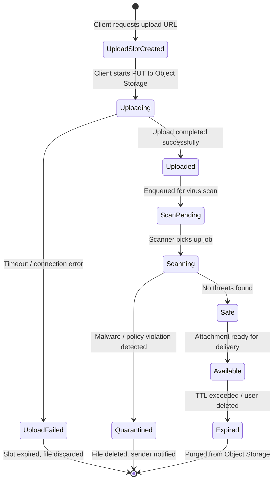

# Lab 1 — Variant 7: Message Attachments (Files / Images)

| Field            | Value                              |
|------------------|------------------------------------|
| Variant          | 7                                  |
| Focus            | Integrations and storage           |
| Date             | 2026-03-09                         |

---

## 📋 Requirements

- Files and images are **not stored directly in the database**
- Upload and delivery are **asynchronous**
- The system must handle **virus/malware scanning** of uploaded files
- Files should be stored in an **external object storage** (S3-like)
- The recipient may be **online or offline** when the file message is delivered

---

## 🧱 Part 1 — Component Diagram

The diagram below shows the main components of a messenger system extended with attachment support.



### Component Responsibilities

| Component          | Responsibility                                                        |
|--------------------|-----------------------------------------------------------------------|
| **Client**         | UI for composing messages, uploading files, rendering media          |
| **Backend API**    | Entry point, routes requests, enforces auth                          |
| **Auth Service**   | Issues and validates JWT tokens                                      |
| **Message Service**| Creates message records, links attachment metadata, triggers delivery |
| **Attachment Service** | Manages upload lifecycle, scanning status, presigned download URLs |
| **Virus Scanner**  | Inspects uploaded files; marks safe or quarantines                   |
| **Message Queue**  | Decouples upload, scanning, and delivery; ensures reliability        |
| **Delivery Service**| Pushes delivery notifications (WebSocket / FCM / APNS) to recipients |
| **Messages DB**    | Stores message metadata + attachment references (no raw files)       |
| **Object Storage** | Stores raw file bytes (S3-compatible bucket)                         |
| **CDN**            | Distributes file downloads via short-lived presigned URLs            |

---

## 🔁 Part 2 — Sequence Diagram

**Scenario:** User A sends an image to User B, who is **offline** at the time.



---

## 🔄 Part 3 — State Diagram

**Object:** `Attachment`

The state machine below describes the full lifecycle of a file attachment from the moment a client requests an upload slot until the file is accessed (or rejected).



### State Descriptions

| State               | Meaning                                                               |
|---------------------|-----------------------------------------------------------------------|
| `UploadSlotCreated` | Server issued a presigned upload URL; file not yet received          |
| `Uploading`         | Client is streaming bytes to Object Storage                          |
| `Uploaded`          | All bytes received; file awaits scanning                             |
| `UploadFailed`      | Upload timed out or was interrupted                                  |
| `ScanPending`       | Scan job queued but not yet started                                  |
| `Scanning`          | Virus scanner is actively inspecting the file                        |
| `Safe`              | File passed all scans                                                |
| `Quarantined`       | File failed scanning; isolated, sender notified                      |
| `Available`         | File can be downloaded via presigned URL                             |
| `Expired`           | File TTL exceeded or manually deleted; removed from storage          |

---

## 📚 Part 4 — ADR

# ADR-001: Use External Object Storage for File Attachments

| Field            | Value                          |
|------------------|--------------------------------|
| Status           | Accepted                       |
| Date             | 2026-03-09                     |
| Decision Makers  | System Designer                |
| Technical Area   | Storage / Integrations         |

## Context

The messenger system (Variant 7) needs to support sending file attachments: images, documents, and videos.

The naive approach — storing raw file bytes as BLOBs inside the relational database — is not viable at any meaningful scale:
* Relational databases are optimized for structured, indexed metadata, not for streaming binary data.
* A single 10 MB image stored as a BLOB occupies the same space as ~10 000 message text rows.
* DB replication carries the full binary payload, making replication lag a serious issue.
* Serving large files through the application tier saturates network I/O and memory.
* There is no built-in CDN integration, lifecycle management (TTL, purge), or virus-scanning hook.

Current naive flow (problematic):
```
Client → API → Message Service → DB (raw bytes stored here ❌)
Client ← API ← DB              (file streamed through app tier ❌)
```

Proposed flow (correct):
```
Client  →  Object Storage         (upload direct via presigned URL ✅)
Client  ←  Object Storage / CDN   (download direct via presigned URL ✅)
API     ←  Attachment Service     (only metadata + scan status ✅)
```

Additional constraints for Variant 7:
* Files must be scanned for malware/viruses before being made available.
* Files have a configurable TTL — they should be automatically purged from storage after expiry.
* Download URLs must not be permanent (access control must be enforced per-request).

## Decision

All raw file bytes are stored in an **S3-compatible object storage bucket** (e.g., MinIO, AWS S3, or GCS).

The Messages DB stores only **metadata**:

| Column         | Type      | Description                              |
|----------------|-----------|------------------------------------------|
| `attachmentId` | UUID      | Primary key                              |
| `bucket`       | string    | Storage bucket name                      |
| `objectKey`    | string    | Path inside the bucket                   |
| `mimeType`     | string    | e.g. `image/jpeg`, `application/pdf`     |
| `sizeBytes`    | integer   | File size in bytes                       |
| `scanStatus`   | enum      | `PENDING`, `SAFE`, `QUARANTINED`         |
| `createdAt`    | timestamp | Upload timestamp                         |
| `expiresAt`    | timestamp | TTL for automatic purge                  |

Key design choices:

* **Direct client-to-storage upload**: The Attachment Service issues a presigned upload URL. The client PUTs file bytes directly to Object Storage — the application tier never touches the binary payload.
* **Presigned download URLs** (TTL: 15 minutes): Clients request a download URL from the Attachment Service on demand. The URL is signed with temporary credentials. This enforces access control server-side without a permanent public URL.
* **Mandatory virus scan**: After upload, a `ScanJob` is enqueued. The file remains in `SAFE`/`QUARANTINED` limbo until scanning completes. Delivery is only triggered after the file is marked `SAFE`.
* **Storage lifecycle rules**: Object Storage bucket policies automatically purge files when `expiresAt` passes, without requiring application-level cron jobs.

## Alternatives

| Option                        | Decision     | Reason                                                                     |
|-------------------------------|--------------|----------------------------------------------------------------------------|
| **DB BLOBs**                  | ❌ Rejected  | Bloats DB, degrades replication, no CDN/TTL support, poor streaming perf   |
| **Local filesystem / NFS**    | ❌ Rejected  | No built-in replication, horizontal scaling is painful, no CDN integration |
| **Store via API tier**        | ❌ Rejected  | App server becomes a bottleneck for large files, high memory pressure      |
| **S3-compatible object store**| ✅ Accepted  | Scalable, durable (99.999999999%), TTL lifecycle, CDN-friendly, presigned  |

## Consequences

Pros:
* The Messages DB stays lean — only lightweight metadata rows, no binary data.
* Object Storage provides built-in durability (11 nines), replication, and versioning.
* Presigned URLs keep access control centralised without a permanent public endpoint.
* Direct client-to-storage upload eliminates API tier as a file-streaming bottleneck.
* CDN can cache frequently downloaded files transparently (e.g. shared media in group chat).
* Lifecycle rules in Object Storage automatically purge expired files without cron jobs.
* Virus scanning is decoupled from the upload path — no added latency for the sender.

Cons:
* Adds Object Storage as a new infrastructure dependency (ops cost, SLA dependency).
* Download requires an extra round-trip to Attachment Service to obtain a presigned URL.
* Virus scanning introduces delivery latency (~2–10 s for small files, more for large ones).
* If Object Storage is degraded, attachments are inaccessible even if the chat service is healthy.
* Presigned URL expiry (15 min) means cached message links eventually break — clients must re-request.

## Consequences for the System

* Attachment Service becomes responsible for upload slot creation, scan status management, and presigned URL generation.
* Message Service must treat `attachmentId` as a foreign reference and must not proceed to delivery until `scanStatus = SAFE`.
* Delivery Service pushes only metadata to the recipient; the recipient client fetches the actual file independently.
* Object Storage bucket must have proper CORS policy to allow direct browser/mobile PUT.

## Resources

- [AWS S3 Presigned URLs documentation](https://docs.aws.amazon.com/AmazonS3/latest/userguide/ShareObjectPreSignedURL.html)
- [MinIO — S3-compatible self-hosted storage](https://min.io/)
- [OWASP File Upload Cheat Sheet](https://cheatsheetseries.owasp.org/cheatsheets/File_Upload_Cheat_Sheet.html)
- Related: Variant 3 (Offline Delivery) — retry strategy for pending deliveries after scan completes
