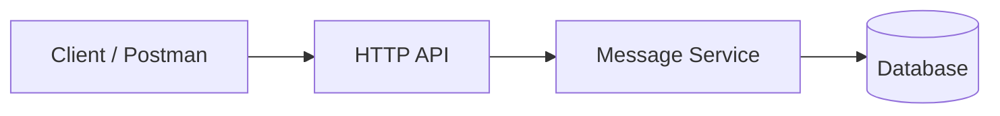
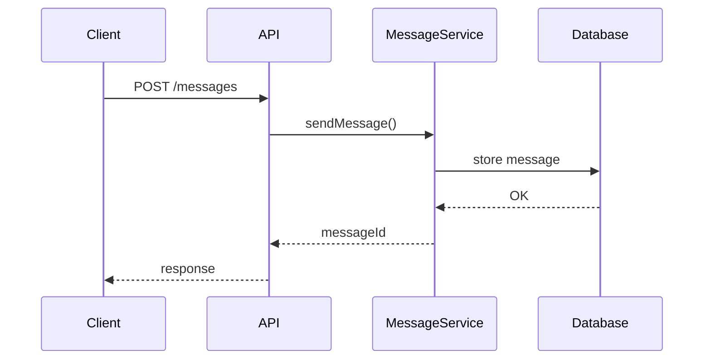

# Laboratory Work 2
## Messenger Implementation

**Course:** Software Design and Documentation  
**Prerequisite:** Lab 1 – System Design  
https://github.com/rmalkevy/Software-Design-and-Documentation/blob/main/lab-1.md

---

# Goal

Implement a **working prototype of a messenger system** based on the design created in **Lab 1**.

Students will:

- continue developing the messenger system designed previously
- implement a minimal but functional system
- practice code structure, persistence, and API testing
- learn to test APIs using **Postman**
- implement a basic **integration test**

The goal is **not to build a production messenger**, but to demonstrate **good software engineering practices**.

---

# Task

Implement the **Minimal Reference Messenger Architecture** described below.

Students may use any programming language:

- TypeScript
- Python
- C#
- Java

Your implementation should follow the design created in Lab 1 (Component / Sequence / State diagrams), but reasonable adjustments are allowed.

---

# Difficulty Variants (Optional)

After implementing the **minimal architecture**, students may extend the system using **one of the 10 variants from Lab 1** (for additional complexity and higher evaluation).

Examples:

- message status tracking
- offline message delivery
- group chat
- typing indicators
- message editing
- file attachments
- end‑to‑end encryption (conceptual)
- message search
- moderation system

Variants **add features**, but the **minimal architecture remains mandatory**.

---

# Mandatory Implementation Requirements

Every solution must include the following.

## 1. Message Persistence

Messages must be stored so they **are not lost after the program stops**.

Possible options:

- SQLite
- PostgreSQL
- JSON / file storage

---

## 2. Unique Identifiers

Each message must include at least:

- `messageId`
- `senderId`
- `timestamp`

---

## 3. Error Handling

The system must correctly handle basic error cases, such as:

- user does not exist
- empty message
- invalid conversation

Clear responses or error messages should be returned.

---

## 4. Modular Code Structure

The project must be organized into logical modules.

Example:

```
/models
/services
/storage
/api
/main
/tests
```

This demonstrates **separation of responsibilities**.

---

## 5. Simple Interaction Interface

The system must provide a way to interact with it:

- HTTP API (recommended)
- CLI
- simple console program

Minimum functionality:

- create users
- send messages
- read message history

---

# API Testing with Postman

Students must test their system using **Postman**.

Typical workflow:

1. Start the server
2. Send requests using Postman
3. Verify stored messages and responses

Example request:

POST `/messages`

```
{
  "senderId": "user1",
  "receiverId": "user2",
  "text": "Hello"
}
```

Postman download:  
https://www.postman.com/

---

# Postman Collection Requirement

Students must include a **Postman Collection** in the repository.

The collection should contain requests for at least:

- creating users
- sending a message
- retrieving message history

This helps demonstrate that the API works and allows easy testing by the instructor.

Example file:

```
postman_collection.json
```

---

# Integration Test Requirement

The project must include **at least one integration test** that verifies a real system flow.

Example scenario:

1. Create user A
2. Create user B
3. Send a message from A to B
4. Retrieve message history
5. Verify that the message exists

The test should interact with the **actual API or service layer**, not only individual functions.

Possible tools:

- Jest / Vitest (TypeScript)
- PyTest (Python)
- xUnit / NUnit (C#)
- JUnit (Java)

---

# Submission Requirements

## 1. Git Repository

The project must be submitted as a **Git repository**.

Requirements:

- working code
- clear commit messages

---

## 2. README

The repository must include a README containing:

- project description
- how to run the program
- project structure
- implemented features

---

## 3. Demonstration

Students must demonstrate that the system works.

Possible formats:

- live demo
- screenshots of API testing in Postman

---

# Defense Questions

Students should be able to explain:

1. How does your system ensure that **messages are not lost**?
2. What happens if the **recipient is offline**?
3. How are **messages uniquely identified**?
4. What **errors** may occur when sending a message?
5. How would your system change to support **1 million users**?

---

# Minimal Reference Architecture

The following architecture **must be implemented by all students**.

### System Overview

```
Client → HTTP API → Message Service → Database
```

The system should support:

- user creation
- sending messages
- retrieving message history

---

# Architecture Diagram



---

# Minimal Data Model

## User

```
User
----
id
name
```

## Conversation

```
Conversation
------------
id
type (direct | group)
```

## Message

```
Message
-------
id
conversationId
senderId
text
createdAt
```

---

# Minimal API

Recommended endpoints.

### Create user

POST `/users`

```
{
  "name": "Alice"
}
```

### Send message

POST `/messages`

```
{
  "conversationId": "1",
  "senderId": "1",
  "text": "Hello"
}
```

### Get messages

GET `/conversations/{id}/messages`

Returns conversation history.

---

# Example Message Flow



---

# Suggested Project Structure

Example project layout:

```
/models
/services
/storage
/api
/tests
/main
```

Example modules:

```
/models
    user
    message
    conversation

/services
    messageService

/storage
    database

/api
    routes

/tests
    integrationTest

/main
    application entry point
```

---

# Best Practices

Focus on:

- clear code structure
- meaningful naming
- small modules
- understandable logic

Avoid:

- putting all logic in one file
- extremely long functions
- copying code without understanding it

A **small working system implemented correctly** is much better than a large unfinished one.
